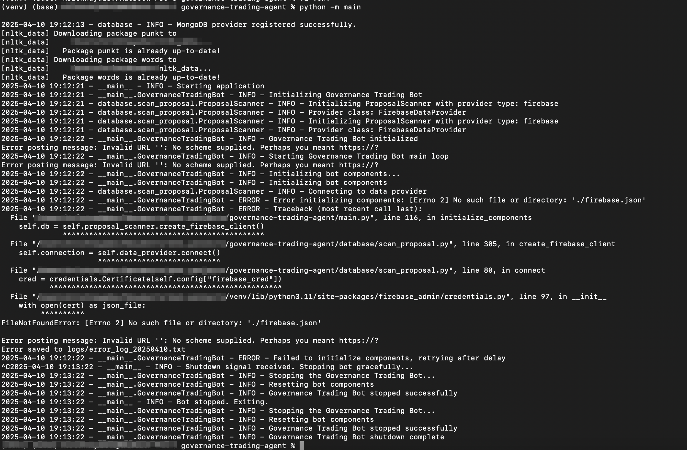

# Data Adapters Guide

This guide explains how to configure and use different data adapters for the Governance Trading Agent.

## Initial Setup Error

When you first run the bot using:
```bash
python -m main
```

You will encounter an error as shown below:



This error occurs because a data adapter needs to be configured. Follow the instructions below to set up your preferred data adapter.

## Environment Setup

Before configuring a data adapter, ensure you have the following environment variables set in your `.env` file:

```env
# Required for all data adapters
DATA_PROVIDER_TYPE=firebase  # or mongodb
DATA_DIR=./data

# For Firebase Adapter
FIREBASE_CRED=/path/to/firebase/credentials.json

# For MongoDB Adapter
MONGO_CONNECTION_STRING=mongodb://localhost:27017/
MONGO_DB_NAME=governance_data
```

For a complete list of environment variables, see the [Environment Setup Guide](env_setup.md).

## Available Data Adapters

The agent supports multiple data adapters for fetching governance proposals:

1. **Firebase Adapter** (Default)
   - Recommended for production use
   - Provides real-time updates
   - Requires Firebase credentials

2. **MongoDB Adapter**
   - Good for local development
   - Supports custom queries
   - Requires MongoDB installation

3. **Custom Adapter**
   - For integrating with other data sources
   - Requires implementation of standard interface

## System Integration

The data adapter is a crucial component in the trading bot's architecture:

```
                             +------------------+
                             |   Data Source    |
                             |   (Governance    |
                             |    Proposals)    |
                             +--------+---------+
                                      |
                                      v
+---------------+           +---------+---------+
|               |           |                   |
|   Firebase/   +<--------->+  ProposalScanner  |
|   MongoDB     |           |                   |
+---------------+           +---------+---------+
```

The data adapter:
1. Fetches governance proposals from various sources
2. Stores them in the configured database
3. Provides data to the ProposalScanner for sentiment analysis
4. Maintains historical proposal data for analysis

## Configuring Data Adapters

### Firebase Adapter (Default)

1. Set in `.env`:
   ```
   DATA_PROVIDER_TYPE=firebase
   FIREBASE_CRED=/path/to/firebase/credentials.json
   ```

2. Place your Firebase credentials JSON file in the specified location

### MongoDB Adapter

1. Set in `.env`:
   ```
   DATA_PROVIDER_TYPE=mongodb
   MONGO_CONNECTION_STRING=mongodb://localhost:27017/
   MONGO_DB_NAME=governance_data
   ```

2. Ensure MongoDB is running and accessible

## Creating Custom Data Adapters

To create your own data adapter:

1. Create a new file in `proposal_revamp/database/` (e.g., `custom_adapter.py`)
2. Implement the required methods:
   - `connect()`
   - `disconnect()`
   - `download_proposals()`
   - `check_new_proposals()`


## Required Data Format

Your data adapter must provide data in the following format:

### Proposal Data Format
- `protocol`: Protocol name (e.g., "uniswap")
- `post_id`: Unique proposal identifier
- `timestamp`: Creation timestamp
- `title`: Proposal title
- `description`: Proposal content
- `discussion_link`: Link to discussion (optional)

### New Proposals Format
- `post_id`: Unique identifier
- `coin`: Protocol/coin name
- `description`: Proposal content
- `discussion_link`: Link to discussion
- `timestamp`: Creation timestamp

### Required Methods

#### `connect()`
Establishes a connection to your data source.

```python
def connect(self):
    """Connect to your data source and return a connection object."""
    # Your connection code here
    return connection_object
```

#### `disconnect(connection)`
Closes the connection to your data source.

```python
def disconnect(self, connection):
    """Disconnect from your data source."""
    # Your disconnection code here
```

#### `download_proposals(connection, scan_mode=True)`
Fetches proposals from your data source.

```python
def download_proposals(self, connection, scan_mode=True):
    """
    Fetch governance proposals from your data source.
    
    Args:
        connection: Connection object from connect()
        scan_mode: If True, fetch recent proposals (~20)
                   If False, fetch more historical data (~1000)
    
    Returns:
        dict: Dictionary mapping protocol names to DataFrames
    """
    # Your implementation here
```

The returned dictionary should map protocol names (e.g., "uniswap", "aave") to pandas DataFrames with the following columns:
- `protocol`: Protocol name 
- `post_id`: Unique identifier for the proposal
- `timestamp`: Creation timestamp
- `title`: Proposal title
- `description`: Proposal text content
- `discussion_link`: URL to discussion (optional)

#### `check_new_proposals(proposals_dict, existing_data_path)`
Identifies new proposals that haven't been processed before.

```python
def check_new_proposals(self, proposals_dict, existing_data_path):
    """
    Identify new proposals not in existing data.
    
    Args:
        proposals_dict: Dictionary from download_proposals()
        existing_data_path: Path to CSV with existing IDs
    
    Returns:
        DataFrame: DataFrame of new proposals
    """
    # Your implementation here
```

The returned DataFrame must have these columns:
- `post_id`: Unique proposal identifier
- `coin`: Protocol/coin name
- `description`: Proposal content
- `discussion_link`: Link to discussion
- `timestamp`: Creation timestamp

```
new_row = {
                        "post_id": post_id,
                        "coin": coin,
                        "description": description,
                        "discussion_link": discussion_link,
                        "timestamp": timestamp
                    }
```

### Example Implementation

Here's a simplified example that pulls data from a REST API:

```python
import pandas as pd
import requests
from datetime import datetime
from .scan_proposal import DataProvider

class RestApiDataProvider(DataProvider):
    """Provider that fetches data from a REST API."""
    
    def __init__(self, config):
        self.config = config
        self.api_url = config.get('rest_api_url', 'https://api.example.com/proposals')
        self.api_key = config.get('rest_api_key')
    
    def connect(self):
        """Create a session for API requests."""
        session = requests.Session()
        session.headers.update({
            'Authorization': f'Bearer {self.api_key}',
            'Content-Type': 'application/json'
        })
        return session
    
    def disconnect(self, connection):
        """Close the session."""
        connection.close()
    
    def download_proposals(self, connection, scan_mode=True):
        """Fetch proposals from the API."""
        limit = 20 if scan_mode else 1000
        response = connection.get(f"{self.api_url}?limit={limit}")
        response.raise_for_status()
        data = response.json()
        
        # Group proposals by protocol
        proposals_by_protocol = {}
        
        for protocol, proposals in data.items():
            df = pd.DataFrame(columns=[
                'protocol', 'post_id', 'timestamp', 'title', 
                'description', 'discussion_link'
            ])
            
            for p in proposals:
                row = [
                    protocol,
                    p['id'],
                    p['created_at'],
                    p['title'],
                    p['body'],
                    p.get('discussion_url', '')
                ]
                
                temp_df = pd.DataFrame([row], columns=df.columns)
                df = pd.concat([df, temp_df], ignore_index=True)
                
            proposals_by_protocol[protocol] = df
            
        return proposals_by_protocol
    
    def check_new_proposals(self, proposals_dict, existing_data_path):
        """Check for new proposals."""
        try:
            existing_ids = list(pd.read_csv(existing_data_path, index_col=0)['post_id'])
        except (FileNotFoundError, pd.errors.EmptyDataError):
            existing_ids = []
        
        new_proposals = pd.DataFrame(columns=[
            "post_id", "coin", "description", "discussion_link", "timestamp"
        ])
        
        for protocol, df in proposals_dict.items():
            for _, row in df.iterrows():
                if row['post_id'] not in existing_ids:
                    new_row = {
                        "post_id": row['post_id'],
                        "coin": protocol,
                        "description": row['description'],
                        "discussion_link": row['discussion_link'],
                        "timestamp": row['timestamp']
                    }
                    new_proposals = pd.concat([
                        new_proposals, pd.DataFrame([new_row])
                    ], ignore_index=True)
                    
        return new_proposals
```

### Registering Your Provider

To register your provider, add this code to `proposal_revamp/database/__init__.py`:

```python
try:
    from .your_provider_module import YourDataProvider
    
    # Store reference to original factory function
    original_create_provider = create_data_provider
    
    # Create a new factory function that handles your provider type
    def new_create_provider(provider_type, config):
        if provider_type.lower() == 'your_type':
            return YourDataProvider(config)
        return original_create_provider(provider_type, config)
    
    # Replace the factory function
    create_data_provider = new_create_provider
except ImportError:
    pass
```

For precise data_adapter code please follow the code which uses the firebase as a service to scan for new proposals [code](../database/scan_proposal.py).